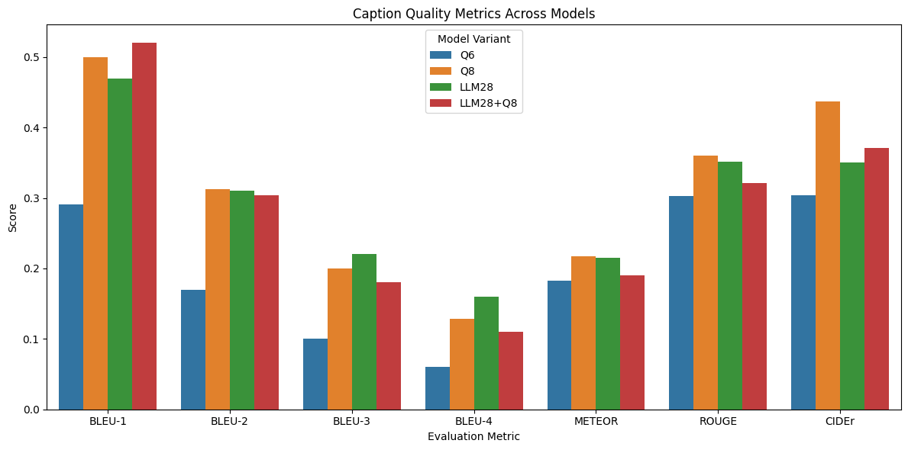

# CWNU Research Internship

This repo contains the evaluation and optimization of vision-language models (PureT, BLIP-2) on the RSICD dataset. The work includes:
- Baseline evaluation of PureT and BLIP-2 using metrics and model characteristics
- LoRA-based fine-tuning of BLIP-2 for remote sensing captioning
- Structural pruning of Q-Former and LLM layers to improve inference speed
- Metric-based evaluation of tradeoffs (BLEU, CIDEr, ROUGE, METEOR)

## Pure T

1. Clone the official [PureT](https://github.com/232525/PureT) repository and set up the model weights as instructed.
2. Run the VisualisationDemo notebook in the provided PureT folder to generate and save a dictionary of predicted captions as a JSON file. This notebook also provides the average inference time, GFLops and number of parameters.
3. Use the generated JSON file as input to the Inference notebook provided in the folder (make sure to replace with your JSON path) and run the notebook to generated BLEU (b1-b4), METEOR, ROUGE and CIDEr scores.

**NOTE:** Caption generation for PureT follows Beam Search with Num_Beams=5

### Baseline Results: PureT on RSICD

| Metric              | Value        |
|---------------------|--------------|
| **BLEU-1**          | 30.009       |
| **BLEU-2**          | 13.440       |
| **BLEU-3**          | 6.577        |
| **BLEU-4**          | 3.670        |
| **METEOR**          | 8.60         |
| **ROUGE-L**         | 21.06        |
| **CIDEr**           | 15.49        |
| **Parameters**      | 229.41M      |
| **Trainable Params**| 34.16M       |
| **GFLOPs**          | 105.48       |
| **Avg Inference Time** | 416 ms   |

## BLIP-2

- For baseline results, run the blip2-inference notebook under the BLIP-2 folder to generate metrics and model characteristics.

### Baseline Results : BLIP-2 on RSICD

| Metric                  | Value        |
|-------------------------|--------------|
| **BLEU-1**              | 36.27        |
| **BLEU-2**              | 17.60        |
| **BLEU-3**              | 8.41         |
| **BLEU-4**              | 4.34         |
| **METEOR**              | 10.56        |
| **ROUGE-L**             | 22.59        |
| **CIDEr**               | 15.19        |
| **Parameters**          | 3.7B         |
| **Trainable Params**    | 188M         |
| **GFLOPs**              | 761.17    |
| **Avg Inference Time**  | 844 ms       |

## Visualizations

### 🔹 PureT Baseline Performance

### 🔹 BLIP-2 Baseline Performance

### 🔹 PureT vs BLIP-2 – Metric Comparison

### 🔹 PureT vs BLIP-2 – Model Characteristics

As for the LoRA fine-tuning, I've uploaded the template notebooks under the BLIP-2 folder:
1. The blip2-lora-finetuning notebook contains the template for using LoRA with various configurations. To try a different config, simply edit the LoraConfig block by adding or removing target_modules or modifying rank or alpha or dropout values. Just make sure to use your own HF token and change model name before pushing to the hub.
2. The blip2-lora-inference notebook contains the evaluation pipeline for pruned models. Just replace the model name with your own model from the hub and run the notebook.
3. If you want to check out all the different LoRA configs, check out the [Finetuning](https://www.kaggle.com/code/bladesofchaos11/blip-2-finetuned) and [Inference](https://www.kaggle.com/code/bladesofchaos11/blip-2-final) notebooks on my Kaggle.

### Results on LoRA Tuned BLIP-2

| Metric                  | Value        |
|-------------------------|--------------|
| **BLEU-1**              | 54.65        |
| **BLEU-2**              | 37.31        |
| **BLEU-3**              | 26.76        |
| **BLEU-4**              | 19.59        |
| **METEOR**              | 26.84        |
| **ROUGE-L**             | 39.13        |
| **CIDEr**               | 43.71        |
| **Parameters**          | 3.7B         |
| **Trainable Params (LoRA)** | 5.24M   |
| **GFLOPs (image→caption)** | 792.91    |
| **Avg Inference Time**  | 2.128 s      |

### Comparison with baseline BLIP-2:

## Pruning Experiments:

The BLIP-2 OPT 2.7B model comprises 3 main modules: CLIP like Vision Encoder, Q-Former with 12 layers and the OPT LLM with 32 layers. Following is the parameter distribution:

| Module          | Description                      | Parameters   |
|-----------------|----------------------------------|--------------|
| **Vision Encoder** | Frozen ViT-L                    | 985M         |
| **Q-Former**       | Lightweight query transformer   | 105M         |
| **Language Model** | OPT-2.7B                        | 2.7B         |
| **Total**          | Full BLIP-2 model               | **~3.7B**     |

I conducted 6 major pruning experiments, out of which 2 were scrapped due to exceptionally bad results. Following is the description of the rest 4:

| Experiment ID     | Pruning Configuration                              | Fine-Tuning Strategy                                  |
|-------------------|----------------------------------------------------|--------------------------------------------------------|
| **Q6**            | Pruned **top 6 layers** of Q-Former                | LoRA on Q-Former + LLM attention layers               |
| **Q8**            | Pruned **top 4 layers** of Q-Former                | LoRA on Q-Former + LLM attention layers               |
| **LLM28**         | Pruned **top 4 layers** of LLM (OPT)               | LoRA on **LLM only** (Q-Former frozen)                |
| **LLM28 + Q8**    | Pruned **4 LLM layers + 4 Q-Former layers**        | LoRA on both Q-Former and LLM attention layers        |

## Pruning Results

### 🔹 Comparing evaluation metrics:

### 🔹 Comparing number of parameters:

### 🔹 Comparing inference time:

### 🔹 Comparing GFlops:

### Some Conclusions:
1. Q-Former has the highest contribution to model GFlops. Reducing Q-Former layers significantly reduces GFlops.
2. LLM has the highest contribution to model parameters (2.7B).
3. Q8 gives a reasonable trade-off in metrics for a significant reduction in inference time compared to baseline LoRA tuned BLIP-2 (reduces from 2.1 secs to 0.4 secs !)
4. LLM28 is a middle ground for good performance metrics with a total of 3.4B parameters (~8.4% reduction) but at the cost of high inference time (2 secs)
5. LLM28 + Q8 strikes the perfect balance, with a negligible reduction in performance metrics, high reduction in parameters (reduces to 3.39B ~ 9.34% reduction) and fast inference time (0.66 secs)

**NOTE:** To check out the exact metrics for each experiment, refer to the Final Report attached in the repo.

### Future Work:

1. Trying other pruning strategies on the LLM, such as CATP.
2. Distilling from the fine-tuned BLIP-2 to a smaller model, such as the SmolVLM-256M
